# HANGMAN
Hangman is a python terminal game played in Code Institute's mock terminal in Heroku. 

## How to play the game
The player must guess all of the letters of a word of a given length, chosen at random, before a complete stick-figure body appears below the gallows. Each wrong guess adds a new body part. Each correct guess is displayed in its proper place, with underscores to represent any letters as-yet unguessed. If the player guesses all of the letters, that is, the whole word, before they're hung, they win. Otherwise, well, they're hung and they lose. Either way, they can play again and again, to their heart's delight. In this version, win or lose, when they quit the game, they walk away in one piece with a friendly goodbye.

## Design
The design of the game was kept purposefully simple. As a lover of word games, I don't like to be distracted by a lot of busy graphics. I considered adding some ascii art or ascii word art to the project, but I personally find some of it to be so visually overwhelming as to cause atual discomfort, so I chose to cater to those with similar tastes to mine. (That said, I think that the addition of color would be beneficial to the user experience in a new iteration.) One aspect of the design I did feel was important, though, was the hangman art. While the hangman art I created is simple, I feel that the humorous messages that accompany each hangman state definitely enhance the user experience. I also chose to program out the possibility of the game using words of length less than four. I just think there is something inherently boring and pointless and frustrating about playing hangman with a three letter word. Just ask Kay, our facilitator. She had 10 tries in the game she showed us and still didn't guess the word!

## User experience

### User stories
As a user, I want at the start
- to see the title of the game,
- to be given clear, concise rules and playing instructions, and
- to see a simple graphic representation of the game.

I then want
- to be able to enter my name to receive a friendly, personalized greeting,
- and to be told exactly what I need to do to start the game.

Throughout play, I want
- to be told exactly what kind of input I need to give,
- to be informed when I've given invalid input and what that input was,
- to be given the chance to give new, valid input,
- to have my input repeated back to me, so I know the game is working,
- to be told if I've made a duplicate guess and given the chance to guess again,
- to be told when I've made a good move or a wrong move,
- to see, both in written and graphic form, the results of my move, and
- to be kept up to date on the progress of the game in terms of what I've guessed so far, both right and wrong, and how many wrong guesses I have left before I lose or how many unguessed letters there are left in word.

Finally, I want
- to be told when the game is over and if I've won or lost,
- to see the whole word displayed at the end of the game, win or lose,
- to be invited to play again or quit, and
- and to be able to play again or receive a friendly goodbye.

I also want an uncluttered terminal and fun but simple (not overwhelming) graphics to keep me interested and in good spirits.

### Developer objectives
As a developer, I want to provide a simple and easy-to-play game that nevertheless provides a new challenge each play. For this reason, I chose to use a list of nearly 3000 words.

I also want to be able to develop the game further, and to this end, for example, I used a google API to import words from a google sheet which can be further modified by sorting the currently unsorted list into new columns in any number of ways, such as by word length, word difficulty, words with x's and z's, or by various themes.

## Features
A few seconds after the app is opened in Heroku, the hangman program removes the default text at the top of the terminal, as it is not part of the game:

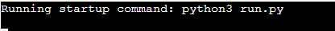

### Game introduction
The opening screen then appears, showing the title, a game graphic, and the rules and instructions, and inviting the player to start the game by entering their name.

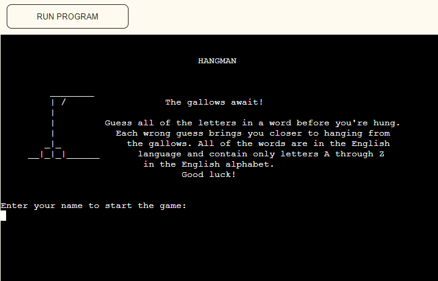

### Personal greeting and game start
After the player enters their name, a new screen appears, welcoming the player by name, showing the empty gallows, and telling (and showing with underscores) the player how many letters are in the word they are to guess, then asking the player to enter a letter.

### Validation of user input
At every step where the user gives input, that input is validated. The user name and user guesses must consist of letters A-Z. The user can only answer Y or N (upper or lower case) to the question of whether they want to play again. If the player types in any other character, more than one character, or no character at all, the game tells the player that they've given invalid input, what that input was, and asks for the input again.

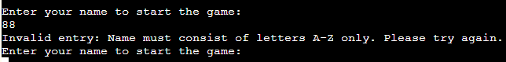

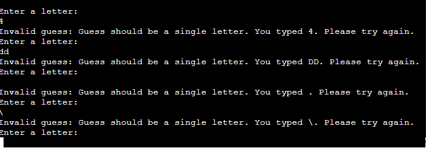

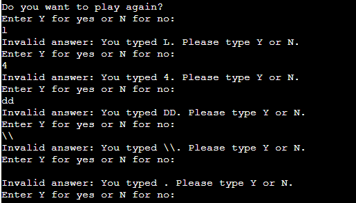

In addition, if a player enters a letter they've already guessed, they are informed and invited to choose again.

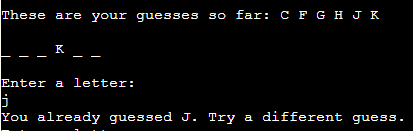

### Regular progress through the game
Each time the player guesses a new letter, the game tells the player whether it was a right or wrong guess and either displays it in the proper place in the word, if it's a correct guess, or displays a new body part hanging from the gallows, if it's an incorrect guess. In addition, the player is shown all of their guesses so far and, for wrong answers, the new state of the gallows. They are also informed of how many wrong guesses they have left until they are hung. They can see in the printed letters-and-underscores representing the word how many letters they still have to guess (though some underscores may represent the same letter occurring in different places, and that is why the program can't tell them the number of right guesses they need to win.)

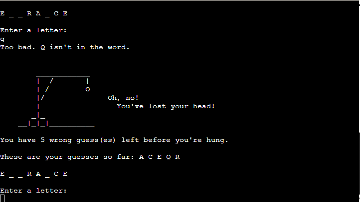

Here are some screenshots of the different states of the gallows that aren't shown elsewhere in the document:

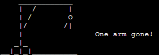

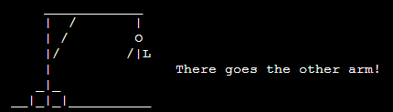

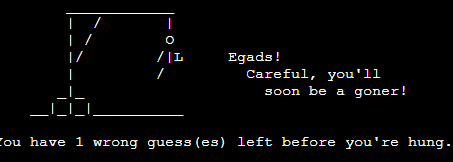

### Game result
When the player has either guessed all of the letters in the word or run out of body parts to be hung, the game displays the game results and asks the player if they want to play again. The game results look like this:

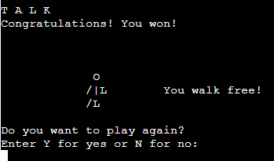

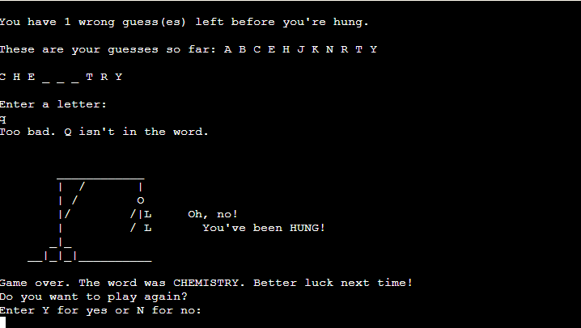

### Play again
Once the player finishes a round of hangman, eithr winning or losing, they are asked if they want to play again. If they choose to play again, the main play loop is started again and a start screen appears as follows:

If the player chooses not to play again, a friendly graphic is displayed, showing a person walking away from the gallows in one piece (just in case they lost their last round!), and the player is given a friendly goodbye and thanks for playing:

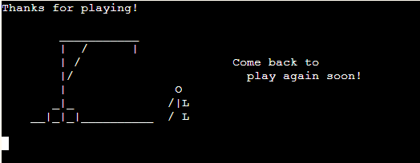

## Testing
### Manual testing
### PEP8 linter

## Development

## Bugs

The empty underscores and the message telling the player how many letters were in the word (i.e., length) kept appearing when it was no longer needed. I recoded so that the terminal would clear that text and not bring it up again after the number of guesses was greater than zero.

When the cursor position for player input of a guess was at the bottom of the heroku terminal, it obscured the first underscore of the unguessed word (i.e., in the case where the first letter had not yet been guessed). This was fixed by adding a line space above the user input field.

The script "Running startup command: python3 run.py" remained at the top of the Heroku terminal during game play. To fix this, I call the clear() function to clear it from the terminal once the main function is called.

When the player chose to play another round of the game, the empty gallows were not printed and the game simply displayed the word length and asked for a guess, yielding poor user experience. To improve user experience in this respect, the print statement for printing the empty gallows was moved to the beginning of the main game loop and deleted from the earlier function asking for the player's name. This made it so that the player would still see the gallows immediately after entering their name but would now also see the empty gallows at the beginning of a new game.

While testing the code intended to allow the player to start a new game or exit, it was discovered that the guesses from the round before were still contained in the various game variables such that display_underscores function was showing not only blank underscores for the number of letters in the new word but also the "correct" placement of letters in the new word taken from the "already guessed" group from the previous game. Here is a screenshot of the issue as it appeared for the player:

### Credits

Many thanks to Code Institute's Marko Tot and Kay Welfare for sharing their hangman projects with me and for their encouragement during weekly standups.

When it came time to make the game more user friendly in terms of clearing unnecessary text from the terminal, I remembered that Marko mentioned a method to do this in his README file. I could see that he used an os method involving 'cls', but I wanted to understand it better before using it. I found some information on [stack overflow](https://stackoverflow.com/questions/63855637/clearing-the-terminal-for-my-python-text-adventure) and then felt I was ready to use the method. However, when I checked back on Marko's GitHub to compare the syntax used, I noticed that his was different. On [Code360 by Coding Ninjas](https://www.naukri.com/code360/library/how-to-clear-a-screen-in-python) I found the explanation I was looking for and decided to use the code as Marko had written it. Many thanks, Marko, for making this piece of code available to me. I later got the idea to us an os method to get the width of the player's terminal from Marko's hangman game in GitHub, which he so kindly shared with me while I was developing this game. I combined this with the code I found at [W3Schools](https://www.w3schools.com/python/trypython.asp?filename=demo_ref_string_center2) for centering the game title in the player's terminal.

I obtained a list of words to use in the game from [Gökhan YAVAŞ](https://github.com/gokhanyavas/Oxford-3000-Word-List), who in turn credits [Oxford Learner's Dictionaries](http://www.oxfordlearnersdictionaries.com/us/wordlist/english/oxford3000/) for a list of 3000 most important words for learners of English, although I weeded out some of the words from the google sheet I copied it to to connect to my program.

